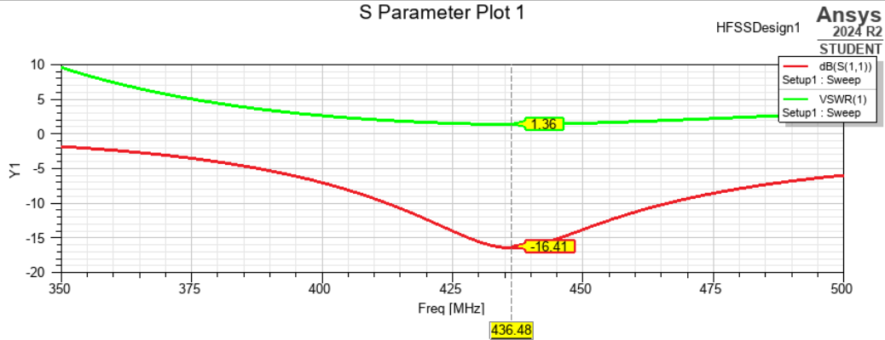

# Intro to Ansys HFSS
Ansys HFSS is a 3D electromagnetic simulation software which can be used for simulation of RF signals
https://www.ansys.com/products/electronics/ansys-hfss

In PAST, we have been using Ansys HFSS for simulating antennas, however there are other software which can do this, such as MATLAB and FEKO

## Installing Ansys HFSS
Ansys HFSS can be obtained as a student license through the Ansys Electronics Desktop. This also contains other software such as Maxwell and Icepak
- [Ansys Electronics Desktop](https://www.ansys.com/academic/students/ansys-electronics-desktop-student)

## Simulating a Dipole Antenna
- [Ansys Provided Tutorial](https://innovationspace.ansys.com/product/simulation-of-a-dipole-array-in-ansys-hfss/)

## Plotting
Here is an example plot of a dipole antenna
